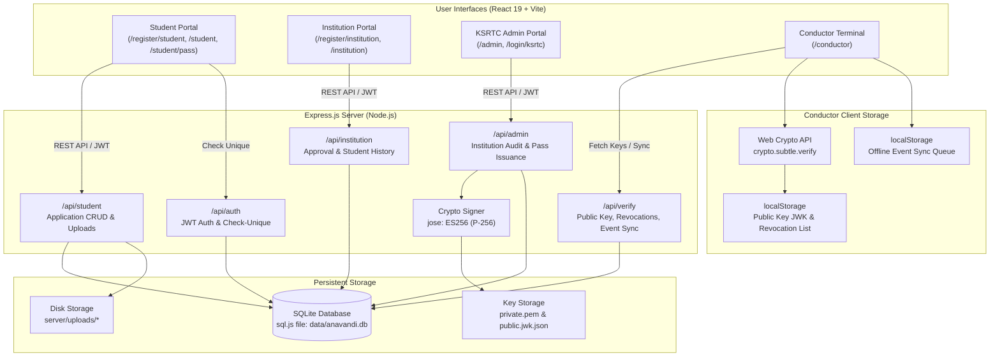
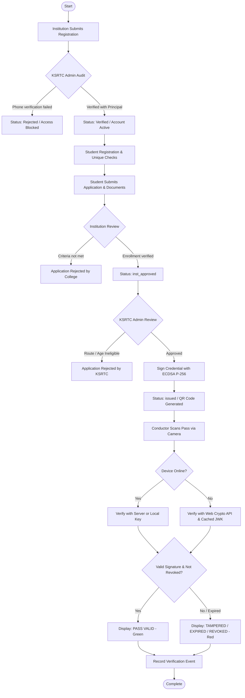

# ANAVANDI — Digital Student Concession Pass Platform

> A digital, cryptographically verifiable bus concession pass platform for Kerala RTC (KSRTC) connecting students, educational institutions, depot administrators, and bus conductors with offline QR verification capability.

---

## 1. Project Header

**ANAVANDI** is a role-based web platform designed for the Kerala State Road Transport Corporation (KSRTC) ecosystem. It digitizes the end-to-end lifecycle of student concession passes: from initial student registration and multi-document submission, through educational institution verification, to KSRTC administrative issuance of ECDSA-signed digital passes and real-time on-bus verification by conductors using device cameras—functioning both online and completely offline.

- **Platform**: Multi-role web application (Desktop & Mobile responsive)
- **Primary Users**: Students, Educational Institutions (Colleges & Schools), KSRTC Depot Administrators, Bus Conductors
- **Core Purpose**: Eliminates manual paper queues and physical seal stamping by providing tamper-proof digital concession passes backed by asymmetric cryptography.

---

## 2. Problem

In Kerala's existing student concession workflow:
- **Physical Queues & In-Person Dependency**: Students must physically collect paper application forms, get physical seals and signatures from college principals, and stand in long depot queues at KSRTC offices before every academic semester.
- **Manual Verification Overhead**: College offices must manually verify enrollment, routes, and eligibility forms against physical registers, consuming substantial administrative time.
- **Verification Bottlenecks on Moving Buses**: Bus conductors operating on crowded routes have only seconds per stop to verify passes. Traditional paper passes lack tamper protection, can be easily duplicated or forged, and cannot be cross-referenced without network connectivity.
- **Duplicate & Fraudulent Claims**: Paper systems struggle to enforce uniqueness across student roll numbers, mobile numbers, and route allocations across multiple depots.

---

## 3. Solution

ANAVANDI replaces the paper-heavy concession pipeline with a four-actor digital platform:

1. **Students** register once, complete guided step-by-step applications with required route details, and upload supporting documents (College ID, Student Photo, Form 1 Certificate, and Ration Card/Aadhaar).
2. **Educational Institutions** (Colleges and Schools) register their institution profile, pass through a manual KSRTC administrative phone/credential verification gate, and review only their own enrolled students' applications.
3. **KSRTC Administration** audits verified colleges, reviews institution-approved student applications, and generates cryptographically signed digital passes using ECDSA P-256 signatures formatted as compact JSON Web Signatures (JWS).
4. **Bus Conductors** access a lightweight web verification terminal to scan student QR passes using standard device cameras via `html5-qrcode`. Verification is computed cryptographically in the browser using the Web Crypto API, delivering instant pass validation even on zero-connectivity rural routes.

---

## 4. Key Features

- **Multi-Role Authentication**: Dedicated authentication flows for Students, Institutions, KSRTC Administration, and Conductors with JWT session handling and role-based route guards.
- **Institution Verification Gate**: Newly registered colleges are placed in `pending_ksrtc_verification` status with login access restricted until verified and approved by KSRTC administrators.
- **Strict Duplicate Registration Prevention**: Multi-attribute uniqueness enforcement on Email ID, 10-digit Indian Mobile Number, and Roll Number per Institution at both pre-flight API and SQLite database index levels.
- **Multi-Document Upload & Inspection**: Handles uploads for College ID card, Student Passport Photo, Form 1 Certificate, and Ration Card/Aadhaar with image/PDF preview modals for approving authorities.
- **Form State Draft Auto-Persistence**: Student registration forms automatically persist input drafts to `localStorage`, preventing data loss if the browser tab is closed or navigated backward.
- **Asymmetric ECDSA P-256 Pass Signing**: Passes are signed on the server with an ES256 private key and packaged into a compact JWS token encoded inside a high-density QR code.
- **Sub-Second Client-Side Offline Verification**: Conductor terminal imports the KSRTC public key JWK into the browser's native `window.crypto.subtle` engine, validating mathematical authenticity with zero round-trip network calls.
- **Offline Scan Queue & Background Sync**: Scans conducted without internet are queued in client `localStorage` (`anavandi_offline_queue`) and batch-synchronized to the server once connectivity is restored.
- **Revocation List Distribution**: Revoked passes are tracked in the database, fetched by conductors during periodic synchronization, and rejected immediately during offline scanning.
- **Mobile-Responsive AppShell & Quick Logout**: Accessible mobile navigation headers, drawer sidebar, and immediate logout/switch account actions on all responsive viewports.

---

## 5. User Roles

### Student
- Self-register with name, email, 10-digit phone, and password.
- Complete concession application: personal info, guardian details, address, academic roll number, course, year, and specific bus route stops with distance.
- Upload ID card, photo, Form 1 certificate, and ration card.
- Track application status in real time (`pending` → `inst_approved` → `issued` or `rejected`).
- View and display issued digital concession pass with scannable QR code and route parameters.

### Institution / College Admin
- Register institution profile with affiliation details, principal name, and official contact phone.
- View real-time institution application status (`Pending Verification`, `Under Review`, `Verified`, `Rejected`).
- Review student applications submitted strictly under their institution ID.
- Inspect student document uploads in full-resolution preview modals.
- Approve valid student applications or reject with specific feedback reasons.
- Monitor enrolled students, issued pass counts, and student travel scan logs.

### KSRTC Admin
- Audit and verify pending educational institutions: review registration data, record official telephone inquiry notes with the principal, mark `Under Review`, and `Approve` or `Reject`.
- Review institution-approved student concession applications across all institutions.
- Issue digital credentials: automatically signs payload with ECDSA P-256 and sets validity to end of academic year (March 31).
- Revoke active credentials with audited reasons (e.g., student discontinuation or route modification).
- Inspect global analytics: total applications, pending passes, active/revoked credentials, and registered institutions.

### Conductor
- Log in to the dedicated mobile-optimized conductor verification terminal (`/conductor`).
- Sync KSRTC public key JWK and active revocation lists when network is available.
- Scan student QR passes directly through the device camera using `html5-qrcode`.
- Receive instant visual feedback: `✅ PASS VALID`, `🚫 TAMPERED / INVALID`, `⏰ PASS EXPIRED`, or `❌ PASS REVOKED`.
- Record verification events locally when offline and synchronize stored batches upon reconnection.

---

## 6. Institution Verification Workflow

To prevent unauthorized entities from creating accounts and approving illegitimate concession passes, institutions undergo an administrative verification workflow:

```
Institution Self-Registration
             ↓
Status: 'pending_ksrtc_verification'
(Login & Dashboard access restricted via HTTP 403)
             ↓
KSRTC Admin Review ("Colleges & Schools" Tab)
             ↓
Administrative Telephone Inquiry with Principal
(Optional: Status marked as 'under_review')
             ↓
KSRTC Decision
    ├── [Approve] → Status: 'verified' → Institution Account Activated
    └── [Reject]  → Status: 'rejected' → Access Denied with Recorded Reason
```

1. **Submission**: When an institution registers, their record is stored with `status = 'pending_ksrtc_verification'`. No JWT token is granted immediately.
2. **Access Control**: Attempting to log in as an unverified institution triggers an HTTP 403 response with an explanatory status message.
3. **Manual Review**: A KSRTC officer views the institution's affiliation number, university, and official phone number. The officer conducts a telephone inquiry with the institution principal to confirm authenticity.
4. **Status Lifecycle**: The officer can update the institution to `under_review`, record internal verification notes, and submit final verification (`verified`) or rejection (`rejected`).
5. **Activation**: Upon verification, institution administrators can log in, view student applications, and approve concessions.

---

## 7. Student Registration Validation

Duplicate registrations and inaccurate credentials are prevented through multi-tiered validation:

### 1. Database-Level Unique Indexes (SQLite)
- **Email**: Case-insensitive unique index `idx_users_email_nocase` on `LOWER(email)`.
- **Phone Number**: Unique index `idx_users_phone_unique` on `phone` (ignoring null/empty).
- **Institution Roll Number**: Scoped unique index `idx_applications_inst_roll` on `(institution_id, LOWER(roll_no))` for all non-rejected applications.

### 2. Real-Time Pre-Flight Validation API
- Endpoint: `GET /api/auth/check-unique?email=...&phone=...&roll_no=...&institution_id=...`
- Runs asynchronously on input blur, highlighting duplicate fields before the user submits the form.

### 3. Server-Side Validation Handlers
- Indian Mobile Format: strictly validated against `/^[6-9]\d{9}$/` and rejected if containing repeated identical digits (e.g., `9999999999`).
- Standardized error responses on conflict (HTTP 409):
  - `"This email ID is already registered."`
  - `"This phone number is already registered."`
  - `"This roll number is already registered."`

---

## 8. Complete System Workflow

```
[Student]                 [Institution]               [KSRTC Admin]             [Conductor]
   │                            │                           │                        │
   ├─► Register / Login         │                           │                        │
   ├─► Submit Application ─────►│                           │                        │
   │   (Docs + Route)           ├─► Inspect Documents       │                        │
   │                            ├─► Approve Application ───►│                        │
   │                            │                           ├─► Verify Eligibility   │
   │                            │                           ├─► ECDSA P-256 Sign     │
   │                            │                           └─► Issue Credential     │
   │◄───────────────────────────┴───────────────────────────┤                        │
   ├─► View Digital Pass & QR                               │                        │
   │                                                        │                        │
   └─► Present QR on Bus ───────────────────────────────────┼───────────────────────►│
                                                            │   [Online or Offline]  │
                                                            │   Web Crypto Verify    │
                                                            │   Display Result:      │
                                                            │   PASS VALID (Green)   │
                                                            │   INVALID / EXPIRED    │
                                                            │                        │
                                                            │◄── Upload Scan Event ──┤
```

---

## 9. System Architecture



---

## 10. Application Journey Flowchart



---

## 11. QR / Camera Verification

The Conductor Terminal (`/conductor`) allows live ticket checking under moving bus conditions:

1. **Operator**: Authenticated bus conductors (`conductor1@ksrtc.in`, `conductor2@ksrtc.in`).
2. **Camera Access**: Operates via standard HTML5 browser camera permissions using the `html5-qrcode` library (`Html5QrcodeScanner`) with back-camera priority on mobile devices.
3. **QR Payload Content**: The QR contains a compact JWS token (`header.payload.signature`) issued by KSRTC.
4. **Decoded Data**: The payload extracts:
   - Credential ID (`cid`)
   - Student Full Name (`name`)
   - Institution Name (`inst`)
   - Roll Number (`sid`)
   - Authorized Route Stops (`route`, `from_stop`, `to_stop`)
   - Validity Window (`from`, `to`)
   - Issuer Identifier (`iss: 'KSRTC-ANAVANDI'`)
5. **Verification Mechanism**:
   - **Online Mode**: Queries `/api/verify/online/:credentialId` for status and stored student photograph.
   - **Offline Mode**: Operates without any internet connection. The browser reads the pre-cached ECDSA P-256 public key JWK (`anavandi_public_key_jwk`), verifies the cryptographic signature with `crypto.subtle.verify`, checks expiry against the device clock, and checks against the cached revocation list (`anavandi_revocations`).
6. **Visual States**:
   - `✅ PASS VALID`: High-contrast green panel displaying student name, institution, permitted route, and expiration date.
   - `🚫 TAMPERED / INVALID`: Signature mismatch or malformed credential.
   - `⏰ PASS EXPIRED`: Today's date exceeds pass validity.
   - `❌ PASS REVOKED`: Pass ID exists in revocation database.
7. **Event Logging**: Every scan is recorded with timestamp, mode (ONLINE/OFFLINE), pass ID, and conductor ID. Offline records are queued in `localStorage` (`anavandi_offline_queue`) and synced via `POST /api/verify/events/batch` upon reconnection.

---

## 12. Technology Stack

| Layer | Technology | Purpose |
|---|---|---|
| **Frontend Framework** | React 19.2 (`react`, `react-dom`) | Single-page reactive application structure |
| **Routing** | React Router 7.18 (`react-router-dom`) | Declarative client-side routing & protected route wrappers |
| **Build Tool** | Vite 8.3 (`vite`, `@vitejs/plugin-react`) | Development server and minified production bundler |
| **Styling** | Vanilla CSS (`client/src/index.css`) | Custom responsive design system, government color scheme, and mobile drawers |
| **QR Generation** | `qrcode.react` 4.2 | Client-side QR rendering of JWS credentials on student passes |
| **Camera QR Scanning** | `html5-qrcode` 2.3 | In-browser camera access and real-time QR barcode decoding |
| **Backend Runtime** | Node.js (ES Modules) | Server execution environment |
| **Web Framework** | Express 4.21 (`express`) | REST API routing, middleware pipeline, static uploads serving |
| **Database** | `sql.js` 1.11 | Pure WebAssembly/JavaScript SQLite engine persisting to `server/data/anavandi.db` |
| **Password Hashing** | `bcryptjs` 2.4 | Salted cryptographic password hashing (cost factor 10) |
| **Session Security** | `jsonwebtoken` 9.0 | JWT issuance and bearer token authorization middleware |
| **Asymmetric Crypto** | `jose` 5.9 | Server-side ECDSA P-256 (ES256) key generation and CompactSign |
| **Client Verification** | Native Web Crypto API (`window.crypto.subtle`) | Browser-native zero-dependency offline signature verification |
| **File Handling** | `multer` 1.4 | Multi-part form processing for ID cards, photos, and PDF certificates |

---

## 13. Data Flow

```
User Action (Browser)
        ↓
Client-Side Validation & State Management (React)
        ↓
HTTP REST Request with Authorization: Bearer <JWT>
        ↓
Express Middleware (cors, authMiddleware, requireRole, requireApprovedInstitution)
        ↓
Route Controller & Parameter Sanitization
        ↓
SQLite Execution (sql.js queries with prepared parameters)
        ↓
Persistent Disk Synchronization (data/anavandi.db)
        ↓
JSON Response to Frontend
        ↓
State Render & Local Storage Caching (Credentials / Offline Sync Queue)
```

---

## 14. Security & Validation

The system implements concrete, verified security controls across all layers:

- **Database-Level Integrity**: Native unique SQLite indexes strictly prevent duplicate emails, mobile numbers, and student roll numbers within the same institution.
- **Role-Based Access Control (RBAC)**: All endpoints are protected by `authMiddleware` and `requireRole(...)`. Students cannot call institution routes, institutions cannot call KSRTC routes, and unapproved users cannot access protected views.
- **Institution Data Isolation**: All institution queries enforce `WHERE institution_id = ?` based on the authenticated session. Institutions can never view or modify students of another college.
- **Institution Status Gating**: Middleware `requireApprovedInstitution` denies access (HTTP 403) to any institution account that has not been approved by KSRTC.
- **Cryptographic Signature Validation**: Passes cannot be fabricated or modified. Altering student name, validity date, or route in the QR payload breaks the ECDSA P-256 signature verification check.
- **Password Protection**: Passwords are never stored in plaintext; all user passwords are encrypted using `bcryptjs` with 10 salt rounds.
- **File Upload Restrictions**: Multer upload pipeline strictly enforces 5MB file limits and validates MIME types to accept only JPEG, PNG, WebP, and PDF formats.

---

## 15. Demo Credentials

> [!WARNING]
> *These credentials are provided strictly for demonstration and evaluation purposes. Do not use them for production accounts.*

All accounts are pre-seeded with password: **`demo123`**

| Role | Name / Organization | Email / Username | Password | Notes |
|---|---|---|---|---|
| **KSRTC Admin** | KSRTC Platform Admin | `admin@ksrtc.in` | `demo123` | Full access to approve institutions, issue passes, revoke passes |
| **College Admin** | Amrita Vishwa Vidyapeetham | `admin@amrita.edu` | `demo123` | Verified college; manages enrolled student applications |
| **College Admin** | Govt. Engineering College, Thrissur | `admin@gec.ac.in` | `demo123` | Verified college; manages student applications |
| **College Admin** | CUSAT, Ernakulam | `admin@cusat.ac.in` | `demo123` | Verified university |
| **Student** | Karthik M V | `karthik@student.in` | `demo123` | Active issued pass (`ANV-2026-000001`, route Ettimadai → Coimbatore) |
| **Student** | Anjali S | `anjali@student.in` | `demo123` | Application in `pending` status |
| **Student** | Meera R | `meera@student.in` | `demo123` | Application in `inst_approved` status |
| **Student** | Devika P | `devika@student.in` | `demo123` | Active issued pass (`ANV-2026-000005`, route Thrissur Town → GEC) |
| **Conductor** | Rajesh Kumar (KSRTC) | `conductor1@ksrtc.in` | `demo123` | Conductor scanner terminal operator |
| **Conductor** | Pradeep Nair (KSRTC) | `conductor2@ksrtc.in` | `demo123` | Conductor scanner terminal operator |

---

## 16. Demo Walkthrough

### Demo 1 — Institution Registration & KSRTC Approval
1. Navigate to `/register/institution`.
2. Submit a new institution: e.g., *"Model Polytechnic College, Palakkad"*, Principal: *"Dr. N. Menon"*, Phone: `9847112233`, Email: `admin@modelpoly.ac.in`.
3. Notice the immediate post-registration screen: status badge is **`⏳ Pending Verification`** with clear instructions that KSRTC telephone inquiry is required.
4. Attempt to log in at `/login/institution` using `admin@modelpoly.ac.in`: blocked with HTTP 403 and pending status notification.
5. Log in as KSRTC Admin at `/login/ksrtc` (`admin@ksrtc.in` / `demo123`).
6. Navigate to **Colleges & Schools** tab; filter by **Pending Verification**.
7. Click **`🔍 Mark Under Review`** to log inquiry status, then click **`✅ Verify & Approve`**.
8. Return to `/login/institution` and sign in: the institution dashboard is now fully accessible.

### Demo 2 — Student Application to Pass Issuance
1. Navigate to `/register/student`. Enter personal details, select the registered institution, enter bus stops (e.g., *Palakkad Town → Model Polytechnic*), and upload required documents.
2. Sign in as the student at `/login`: dashboard displays status as **`PENDING INSTITUTION VERIFICATION`**.
3. Sign in as the Institution Admin at `/login/institution`. Locate the application under **Pending Applications**, inspect the uploaded ID card and photo in the modal, and click **`Approve Application`**.
4. Sign in as KSRTC Admin at `/login/ksrtc`. The application appears under **Approved by College — Pending KSRTC Review**. Click **`Approve & Issue Pass`**.
5. Return to the Student login: open **My Pass** (`/student/pass`). The active concession pass with high-density QR code is rendered.

### Demo 3 — Conductor QR Scanning (Online & Offline)
1. Navigate to `/conductor` and log in as `conductor1@ksrtc.in` / `demo123`.
2. Notice the network indicator shows **`Online`** and public key sync is completed.
3. Click **Start Camera Scan** and scan student Karthik M V's pass (or test token).
4. The scanner immediately displays the green **`✅ PASS VALID`** card with student name, permitted route, and expiration date.
5. **Offline Test**: Disconnect internet connectivity (or switch to offline mode in browser DevTools). Scan the pass again: verification executes in <15ms directly via `crypto.subtle` with zero network connection. The scan event is queued in local memory.
6. Reconnect internet: conductor panel automatically synchronizes the queued event to the server.

### Demo 4 — Duplicate Registration Prevention
1. Open `/register/student`.
2. Enter an already registered Email (`karthik@student.in`): a red warning appears: *"This email ID is already registered."*
3. Enter an already registered Phone Number (`9400012351`): rejected with *"This phone number is already registered."*
4. Select *Amrita Vishwa Vidyapeetham* and enter existing Roll Number `21CS045`: rejected with *"This roll number is already registered."*

---

## 17. Project Structure

```
ANAVANDI/
├── client/                                 # Frontend Application (React 19 + Vite)
│   ├── index.html                          # HTML Entry Point
│   ├── vite.config.js                      # Vite Configuration & Backend Proxy
│   ├── package.json                        # Frontend Dependencies
│   └── src/
│       ├── main.jsx                        # React Root Mounting
│       ├── App.jsx                         # AppShell, Routes & Protected Wrappers
│       ├── App.css                         # App-specific Layout Styles
│       ├── index.css                       # Comprehensive Design System & Mobile CSS
│       ├── api.js                          # Centralized Fetch Client & Token Storage
│       ├── components/
│       │   ├── Navbar.jsx                  # Official Top Navigation Bar
│       │   ├── Sidebar.jsx                 # Role-Based Dashboard Sidebar
│       │   └── StepIndicator.jsx           # Multi-step Application Wizard Indicator
│       ├── pages/
│       │   ├── Landing.jsx                 # Public Home Page & Quick Login Hero
│       │   ├── Login.jsx                   # Role-Specific Login Portals
│       │   ├── StudentRegister.jsx         # 3-Step Student Application Wizard
│       │   ├── InstitutionRegister.jsx     # Institution Registration & Verification State
│       │   ├── StudentDashboard.jsx        # Student Status Overview
│       │   ├── StudentPass.jsx             # Digital Pass Display & QR Code
│       │   ├── InstitutionDashboard.jsx    # Institution Application Review & Student Logs
│       │   ├── AdminDashboard.jsx          # KSRTC Admin Management & Pass Issuance
│       │   ├── ConductorVerifier.jsx       # Camera QR Scanner & Offline Verification
│       │   ├── About.jsx                   # Portal Information Page
│       │   └── Downloads.jsx               # Form Downloads & Guidelines
│       └── crypto/
│           └── verify.js                   # Web Crypto API Offline Signature Verifier
│
├── server/                                 # Backend REST API (Node.js + Express)
│   ├── index.js                            # Express Server Entry Point (Port 3001)
│   ├── db.js                               # SQLite Database Engine & Schema (sql.js)
│   ├── seed.js                             # Seed Script with Realistic Demo Data
│   ├── package.json                        # Server Dependencies
│   ├── data/                               # Persistent Storage Directory
│   │   └── anavandi.db                     # Exported SQLite Database File
│   ├── uploads/                            # Student Uploaded Documents & Photos
│   ├── keys/                               # Cryptographic Keys
│   │   ├── private.pem                     # ECDSA P-256 Private Signing Key
│   │   ├── public.pem                      # Public Key in SPKI PEM Format
│   │   └── public.jwk.json                 # Public Key in JWK Format for Web Crypto
│   ├── crypto/
│   │   ├── keygen.js                       # One-time Key Generation Script
│   │   └── sign.js                         # Compact JWS Credential Signer
│   └── routes/
│       ├── auth.js                         # Authentication & Duplicate Pre-flight
│       ├── student.js                      # Concession Application & Document Uploads
│       ├── institution.js                  # College Application Approvals & History
│       ├── admin.js                        # KSRTC Verification, Issuance & Revocation
│       └── verify.js                       # Verification Endpoint & Offline Event Sync
│
├── vercel.json                             # Production SPA Rewrite Rules
└── README.md                               # Project Documentation
```

---

## 18. Installation & Running

### Prerequisites
- **Node.js**: v18.0.0 or higher
- **npm**: v9.0.0 or higher

### 1. Clone the Repository
```bash
git clone https://github.com/Veerakarthik-M/coderoad.git
cd coderoad
```

### 2. Setup and Start Backend Server
```bash
cd server
npm install

# (Optional) Seed the database with demo accounts and passes
npm run seed

# Start the backend server
npm start
```
*The server will start on `http://localhost:3001`.*

### 3. Setup and Start Frontend Client
In a separate terminal window:
```bash
cd client
npm install

# Start the Vite development server
npm run dev
```
*The client application will start on `http://localhost:5173`.*

---

## 19. Current Implementation

| Module / Feature | Status | Implementation Details |
|---|---|---|
| **Student Authentication** | **Implemented** | JWT tokens, password hashing via `bcryptjs`, protected routes |
| **Institution Registration** | **Implemented** | Captures college affiliation, principal contact; sets status to pending |
| **KSRTC Institution Verification** | **Implemented** | Admin workflow: phone inquiry notes, `under_review`, `verified`, `rejected` |
| **Duplicate Prevention** | **Implemented** | Database unique indexes and `/api/auth/check-unique` for email, phone, roll number |
| **Concession Application Wizard** | **Implemented** | Step-by-step form with draft auto-save to `localStorage` |
| **Multi-Document Upload** | **Implemented** | Multer disk storage for ID card, photo, Form 1, ration card |
| **Institution Application Review** | **Implemented** | Approval and rejection with document preview modal |
| **KSRTC Pass Issuance** | **Implemented** | Approves pass, signs credential payload with ECDSA P-256 JWS |
| **Digital Concession Pass** | **Implemented** | Visual pass with QR code generation via `qrcode.react` |
| **Conductor Camera Scanner** | **Implemented** | Live browser camera scanning via `html5-qrcode` |
| **Offline Verification** | **Implemented** | ECDSA P-256 signature verification via browser Web Crypto API |
| **Offline Event Sync** | **Implemented** | Queues verification events in `localStorage`; batch syncs when online |
| **Pass Revocation** | **Implemented** | Admin revocation workflow and conductor revocation list sync |
| **Mobile Navigation & Logout** | **Implemented** | Responsive mobile drawer, sticky header logout, landing sign-out button |

---

## 20. Competition Summary

**ANAVANDI** delivers a complete digital transformation of the student bus concession pass system for Kerala KSRTC. By unifying students, educational institutions, transport administrators, and bus conductors onto a single cohesive platform, it resolves the systemic delays, physical queues, and verification challenges of paper passes.

Crucially, the platform bridges the gap between digital security and real-world rural transit constraints: through asymmetric ECDSA P-256 signatures and the browser-native Web Crypto API, bus conductors can verify passenger passes in fractions of a second with zero internet connectivity. Combined with an administrative institution approval gate and multi-field uniqueness validation, ANAVANDI presents a practical, dependable, and fully functioning solution built specifically for the operational needs of public transport in Kerala.
